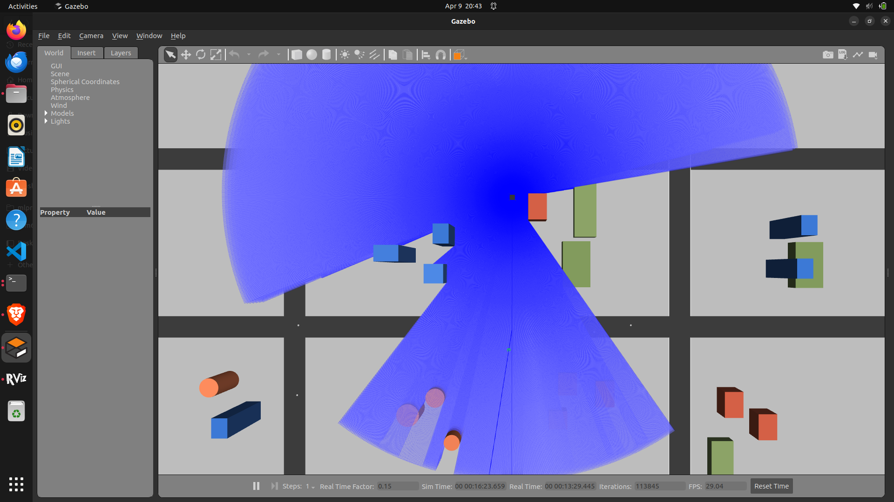
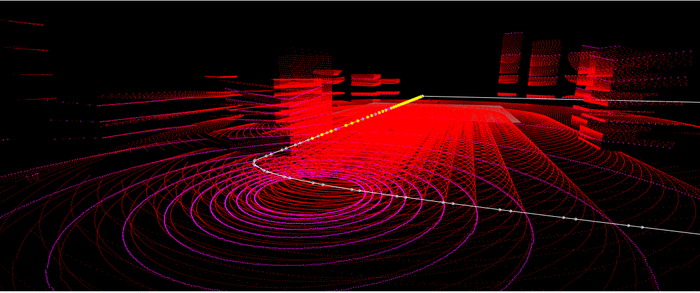
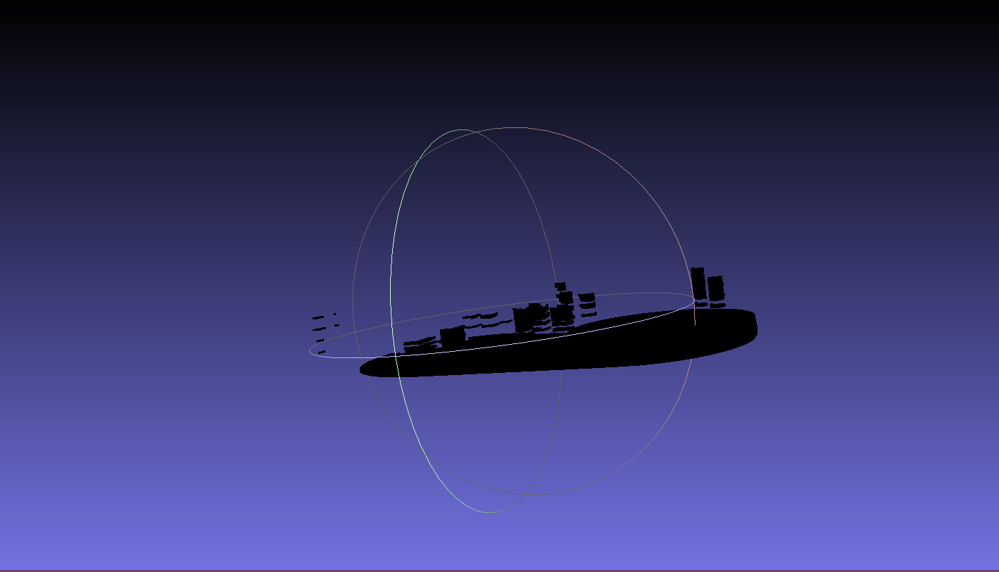
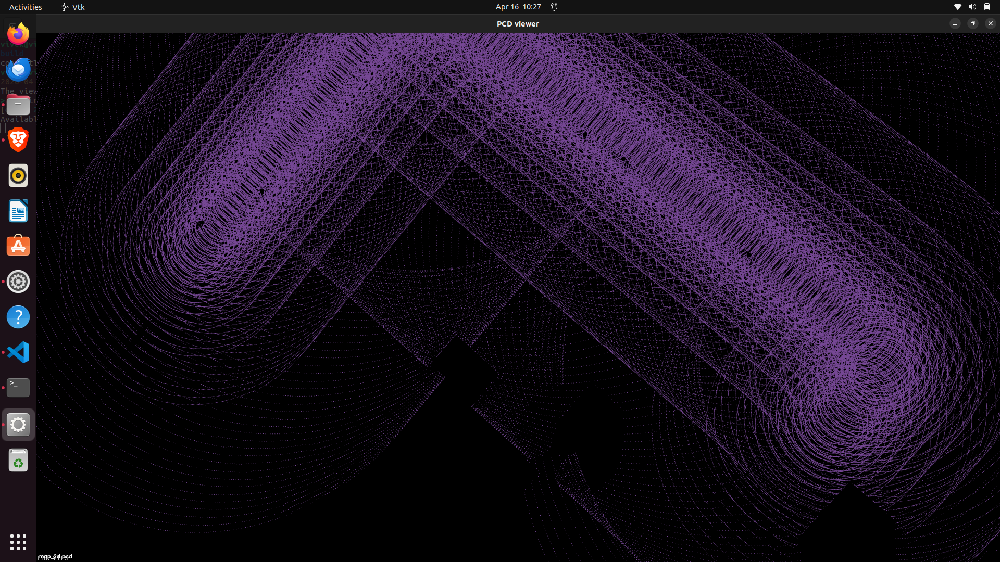

# 🚀 Drone-Based 3D Mapping using ROS2 (RTAB-Map)

## 📌 Project Overview

This project demonstrates **3D environment mapping using a drone in ROS2 Humble**.
A simulated drone equipped with a LiDAR sensor collects data while flying over a city environment in Gazebo. The collected data is processed using **RTAB-Map SLAM** to generate a **3D point cloud map**, which can also be exported for further analysis (e.g., pothole detection).

---

## 👨‍💻 Author

**Vivek G**

---

## 🗂️ Project Structure

```
DRONE_MAPPING_ROS2_HUMBLE/
|__ images                       # resultes
│── drone_waypoint_follower.py   # Drone control script
│── small_city.world             # Gazebo environment
│── rosbag2_*/                   # Recorded sensor data
│── final.db                     # RTAB-Map database
│── map.pcd_cloud.ply            # Exported 3D map
│── README.md                    # Project documentation
```

---

## ⚙️ Requirements

* ROS2 Humble
* Gazebo
* RTAB-Map (`rtabmap`, `rtabmap_ros`, `rtabmap_slam`)
* Python3
* PCL / MeshLab (for visualization)

---

## 🚀 Workflow

### 1. Launch Simulation Environment

```bash
gazebo small_city.world
```

---

### 2. Run Drone Control Script

```bash
python3 drone_waypoint_follower.py
```

---

### 3. Record Sensor Data (Rosbag)

```bash
ros2 bag record \
/drone/lidar/points \
/drone/odom \
/drone/imu \
/tf \
/tf_static
```

---

### 4. Run RTAB-Map SLAM (3D Mapping)

```bash
ros2 run rtabmap_slam rtabmap \
--ros-args \
-p use_sim_time:=true \
-p subscribe_scan_cloud:=true \
-p subscribe_depth:=false \
-p subscribe_rgb:=false \
-p subscribe_scan:=false \
-p approx_sync:=true \
-p sync_queue_size:=100 \
-p publish_cloud:=true \
-p args:="--delete_db_on_start \
--Reg/Strategy 1 \
--Icp/PointToPlane true \
--Grid/3D true \
--Grid/RangeMax 50 \
--Grid/CellSize 0.05 \
--Cloud/Decimation 1 \
--Cloud/MaxDepth 100 \
--Optimizer/Strategy 0 \
--RGBD/OptimizeMaxError 0 \
--Mem/IncrementalMemory true" \
--remap scan_cloud:=/drone/lidar/points \
--remap odom:=/drone/odom
```

---

### 5. Visualize Mapping (RTAB-Map Viz)

```bash
ros2 run rtabmap_viz rtabmap_viz \
--ros-args \
-p use_sim_time:=true \
-p subscribe_scan_cloud:=true \
-p subscribe_depth:=false \
-p approx_sync:=true \
--remap scan_cloud:=/drone/lidar/points \
--remap odom:=/drone/odom
```

---

### 6. Stop SLAM and Save Database

```bash
Ctrl + C
cp ~/.ros/rtabmap.db final.db
```

---

### 7. Export 3D Map

```bash
rtabmap-export --cloud --scan --output map.pcd final.db
```

Output file:

```
map.pcd_cloud.ply
```

---

## 🖼️ Results

### 🌆 Gazebo Simulation



---

### 📡 RTAB-Map Visualization



---

### 🗺️ Generated 3D Map



---

## Generate 2D Map



---


## 🎯 Features

* Real-time drone simulation in Gazebo
* LiDAR-based 3D mapping
* ROS2-based SLAM pipeline
* Exportable dense point cloud (~900k+ points)
* Supports further processing (e.g., pothole detection)

---

## ⚠️ Notes

* Proper synchronization (`use_sim_time`) is critical
* TF (`/tf`, `/tf_static`) must be recorded
* Slower bag playback improves SLAM quality

---

## 🚀 Future Work

* Automatic pothole detection using point cloud analysis
* Path planning integration
* Real-world drone deployment

---

## 📌 Conclusion

This project successfully demonstrates a **complete 3D SLAM pipeline using ROS2**, from simulation and data collection to map generation and export. The system is robust and can be extended for real-world autonomous navigation and terrain analysis.

---

